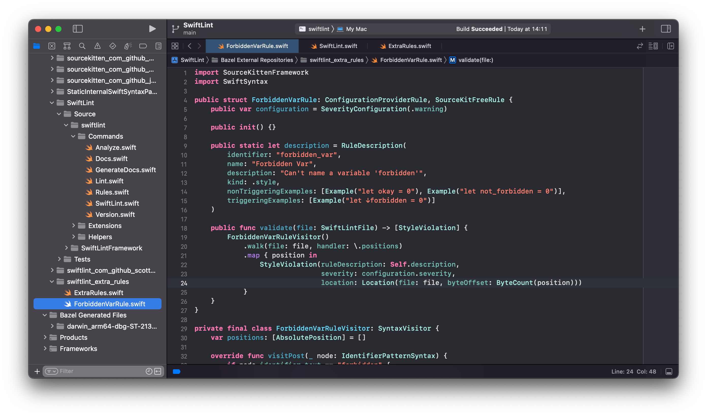

# SwiftLint Bazel Example

This is an example repo that integrates [SwiftLint][SwiftLint] with
[Bazel][Bazel].

## Pre-Requisites

* Install Bazel or Bazelisk (recommended): https://github.com/bazelbuild/bazelisk#installation
* Install Xcode 13.3 or later: https://developer.apple.com/xcode/
* You must be running macOS 12 or later

## Basic Integration

_Please see [SwiftLint's bazel instructions][swiftlint-bazel-instructions]
if these instructions become out of date._

Put this in your `WORKSPACE`:

```python
load("@bazel_tools//tools/build_defs/repo:http.bzl", "http_archive")

http_archive(
    name = "build_bazel_rules_apple",
    sha256 = "36072d4f3614d309d6a703da0dfe48684ec4c65a89611aeb9590b45af7a3e592",
    url = "https://github.com/bazelbuild/rules_apple/releases/download/1.0.1/rules_apple.1.0.1.tar.gz",
)

load(
    "@build_bazel_rules_apple//apple:repositories.bzl",
    "apple_rules_dependencies",
)

apple_rules_dependencies()

load(
    "@build_bazel_rules_swift//swift:repositories.bzl",
    "swift_rules_dependencies",
)

swift_rules_dependencies()

load(
    "@build_bazel_rules_swift//swift:extras.bzl",
    "swift_rules_extra_dependencies",
)

swift_rules_extra_dependencies()

http_archive(
    name = "SwiftLint",
    sha256 = "e954f4483f7f4cf523896693ee3505585f6beb0f791e362b42d9bdbb615f051a",
    url = "https://github.com/realm/SwiftLint/releases/download/0.49.0-rc.1/bazel.tar.gz",
)

load("@SwiftLint//bazel:repos.bzl", "swiftlint_repos")

swiftlint_repos()

load("@SwiftLint//bazel:deps.bzl", "swiftlint_deps")

swiftlint_deps()
```

Then you can run SwiftLint in the current directory with this command:

```console
bazel run -c opt @SwiftLint//:swiftlint -- --help
```

## Custom Rules

### Setup

You can define a "local repository" in your `WORKSPACE` file to add
additional custom, private, native SwiftLint rules:

```python
local_repository(
    name = "swiftlint_extra_rules",
    path = "swiftlint_extra_rules",
)
```

Then make a directory with the path you specified, and add a stub
`extraRules()` function:

```console
mkdir swiftlint_extra_rules
echo "func extraRules() -> [Rule.Type] { [] }" > swiftlint_extra_rules/ExtraRules.swift
```

Finally, you'll need to tell Bazel what source files you want to compile
as part of SwiftLint in `swiftlint_extra_rules/BUILD`. For example:

```python
filegroup(
    name = "extra_rules",
    srcs = glob(["**/*.swift"]),
    visibility = ["//visibility:public"],
)
```

### Writing Rules

Then any Swift sources you add in the `swiftlint_extra_rules` directory
will be compiled as part of the `SwiftLintFramework` module just as if
those files had been in the official upstream SwiftLint git repository.

This means you have access to all the internal APIs in that module.
These internal APIs can and will change over time, so you may need to
adjust the custom code you write accordingly whenever you update the
version of SwiftLint you target.

Be sure to add your rule to the `extraRules()` function you defined
earlier.

Then build and run SwiftLint and you should see your rule being applied:

```console
$ bazel run -c opt @SwiftLint//:swiftlint
Linting Swift files in current working directory
Linting 'ForbiddenVarRule.swift' (2/3)
Linting 'file.swift' (1/3)
Linting 'ExtraRules.swift' (3/3)
file.swift:1:14: warning: Colon Spacing Violation: Colons should be next to the identifier when specifying a type and next to the key in dictionary literals. (colon)
file.swift:1:5: warning: Forbidden Var Violation: Can't name a variable 'forbidden' (forbidden_var)
Done linting! Found 2 violations, 0 serious in 3 files.
```

### Testing Rules

You can validate the triggering, non-triggering and correction examples
in your rule's description by running SwiftLint's "extra rules" tests:

```console
bazel test --test_output=streamed @SwiftLint//Tests:ExtraRulesTests
```

## Developing in Xcode

You can use the excellent [rules_xcodeproj][rules_xcodeproj] project to
generate an Xcode project giving you Xcode's IDE functionality to help
you develop your rules.

You can add it to the bottom of your `WORKSPACE` file:

```python
http_archive(
    name = "com_github_buildbuddy_io_rules_xcodeproj",
    sha256 = "1bfc8589398afc31c47c3cb402f848c89ea11f8992c3f1c8e93efafa23619a7f",
    # https://github.com/buildbuddy-io/rules_xcodeproj/pull/900
    strip_prefix = "rules_xcodeproj-da3c32c91653cd98d4cb0bb7ffe9ac81a6f5f800",
    url = "https://github.com/buildbuddy-io/rules_xcodeproj/archive/da3c32c91653cd98d4cb0bb7ffe9ac81a6f5f800.tar.gz",
)

load("@com_github_buildbuddy_io_rules_xcodeproj//xcodeproj:repositories.bzl", "xcodeproj_rules_dependencies")

xcodeproj_rules_dependencies()
```

And define a `BUILD` file with this configuration:

```python
load("@com_github_buildbuddy_io_rules_xcodeproj//xcodeproj:xcodeproj.bzl", "xcodeproj")

xcodeproj(
    name = "swiftlint_xcodeproj",
    build_mode = "bazel",
    project_name = "SwiftLint",
    tags = ["manual"],
    top_level_targets = [
        "@SwiftLint//:swiftlint",
        "@SwiftLint//:SwiftLintFramework",
        "@SwiftLint//Tests:ExtraRulesTests",
    ],
)
```

Generate and open the Xcode project with this command:

```console
bazel run :swiftlint_xcodeproj && xed .
```

At which point you should have access to most Xcode features you'd want
when developing.



[SwiftLint]: https://github.com/realm/SwiftLint
[Bazel]: https://bazel.build
[swiftlint-bazel-instructions]: https://github.com/realm/SwiftLint#using-bazel
[rules_xcodeproj]: https://github.com/buildbuddy-io/rules_xcodeproj
